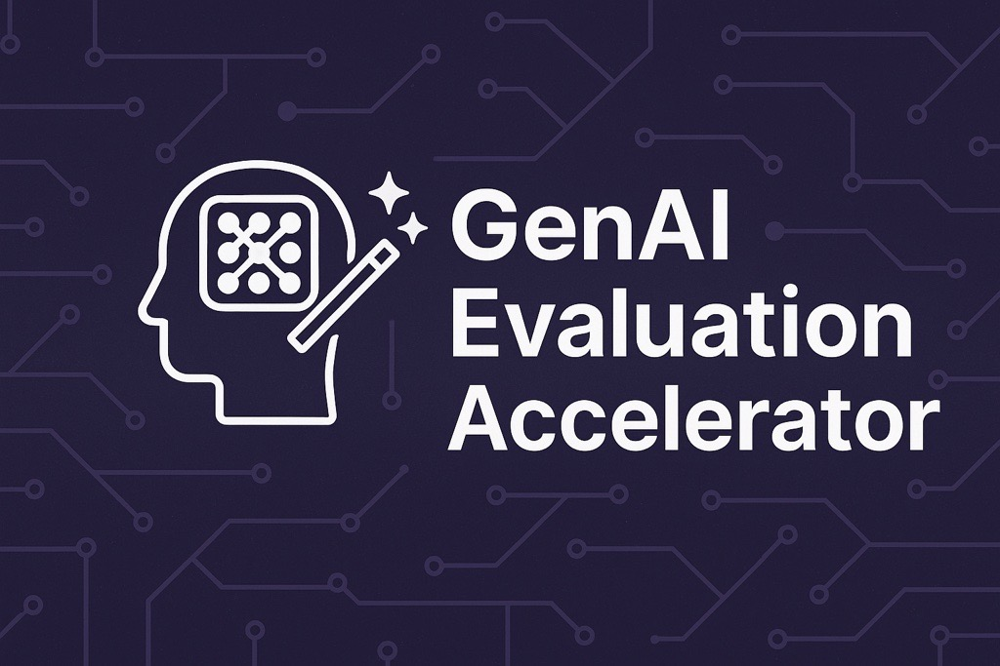
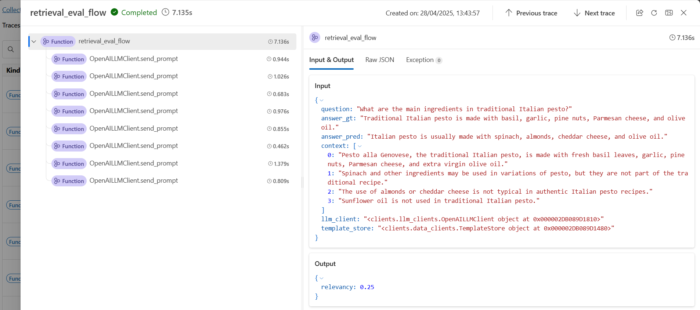

<p align="center">
  
</p>

# GenAI Evaluation Accelerator

Welcome to the **GenAI Evaluation Accelerator** – a modular framework developed by the **EY FSO Belgium Data & AI team** to evaluate core functionalities of generative AI applications powered by LLMs.

This accelerator enables fast and consistent testing of tasks like:
- ✅ Zero-shot / Few-shot Classification  
- ✅ Intent Detection  
- ✅ Retrieval-Augmented Generation (RAG)

It provides plug-and-play evaluation flows for both **retrieval** and **generation**, with support for **multiple LLM clients** and **custom metric definition using Jinja templates**.

---

## 🚀 Key Features

- ⚙️ **Modular Evaluation Flows** for generation and retrieval tasks  
- 📊 **Built-in LLM-Based and Heuristic Metrics**: Faithfulness, Precision, Recall, Relevancy  
- 🤖 **Multi-provider LLM Support**: AWS Bedrock, Azure OpenAI, Mistral  
- 🧩 **Extensible Tooling** via Pydantic-based function calling  
- 🧠 **Prompt Templating** using Jinja to standardize evaluation logic  
- 🧪 **Notebook Examples** for quick experimentation  

---

## 🗂️ Repository Structure

```bash
.
├── clients/          # Standardized LLM clients (AWS Bedrock, Azure OpenAI, Mistral)
├── flows/            # Evaluation flows (retrieval and generation)
├── interfaces/       # Common dataclasses and interfaces
├── metrics/          # Evaluation metrics (faithfulness, precision, recall, relevancy)
├── templates/        # Jinja templates for structuring prompts and metric logic
├── evaluation_test.ipynb  # Example notebook demonstrating evaluation setup
├── pyproject.toml
└── README.md
```

## 📚 Evaluation Flows

#### 🧠 Generation Evaluation Flow
Evaluates LLM-generated outputs using:

- **Faithfulness**: Checks if the answer aligns with the context provided and doesn't contain hallucinations
- **Relevancy**: Checks if the response answers what was asked and addresses the query
- **Coherence**: Evaluates the logical flow and clarity of the generated content

#### 🔎 Retrieval Evaluation Flow
Evaluates retriever quality using:

- **Contextual Precision**: Assesses how relevant retrieved documents are to the query and answer
- **Contextual Recall**: Evaluates whether all necessary information was retrieved to answer the query
- **Exact Context Matching**: Determines if the exact relevant passages were retrieved for the question

All flows are built with modularity and extensibility in mind and live inside the flows/ folder.

## 🤖 LLM Client Abstraction
Located in clients/, these classes provide a unified interface to interact with different LLM backends.

Supported Clients:
* AWS Bedrock (supports structured output and function calls)
* Azure OpenAI (supports structured output and function calls)
* Mistral via Azure Serverless (limited structured output support)

They support:
   * Prompt sending
   * Tool calling / function execution
   * Structured response parsing (via Pydantic)
   * Plug-and-play usage across evaluation flows

## 🧪 Metrics
Implemented in the metrics/ folder as modular components.

Available Metrics (both llm as a judge and deterministic):
* FaithfulnessMetric
* PrecisionMetric
* RecallMetric
* RelevancyMetric
* CosineSimilarity
* JaccardSimilarity
* LevenshteinRatio
* BlueScore


All LLM-based metrics leverage prompt templates defined in the templates/ folder to structure the LLM call and parse responses.

## 📝 Prompt Templates
All LLM-based metric logic is defined using Jinja templates in the templates/ folder, enabling clear, maintainable evaluation prompts.

Templates define:
* The format of the LLM input
* Expected output parsing format
* Instructional framing for zero/few-shot tasks

## 🧱 Requirements
* Python 3.11+
* Azure OpenAI, AWS Bedrock, or Mistral access
* Core libraries: pydantic, jinja2, etc.


```bash
# Clone the repository
git clone https://github.com/your-username/your-repo-name.git
cd your-repo-name

# Create a venv with python 
python -m venv .venv

# install uv
pip install uv

# sync all packages
uv sync
```

## 🔨 Building the Package

You can build this package as a wheel using uv:

```bash
# Activate your virtual environment first
source .venv/bin/activate  # On Windows: .venv\Scripts\activate

# Build the wheel
uv build

# The wheel file will be available in the dist/ directory
# Install the wheel
uv pip install dist/genai_evaluator-0.1.0-py3-none-any.whl

# Or to install in development mode
uv pip install -e .
```

## 🚀 Test it Yourself

To quickly try out the evaluation flows in this accelerator, you can use the example notebook:

📍 **Notebook**: [`evaluation_test.ipynb`](evaluation_test.ipynb)

This notebook demonstrates how to:

- Plug in your own test samples with the required structure.
- Run generation or retrieval evaluation flows.
- Use LLM-based and standard metrics to assess performance.

### 🔐 Required Credentials

Before running the notebook, make sure to set the following environment variables (or define them directly in your notebook):

```bash
# For Azure OpenAI
AZURE_OPENAI_API_VERSION=
AZURE_OPENAI_API_KEY=
AZURE_OPENAI_ENDPOINT=
AZURE_OPENAI_DEPLOYMENT_NAME=

# For AWS Bedrock (if using)
AWS_ACCESS_KEY_ID=
AWS_SECRET_ACCESS_KEY=
AWS_REGION=
```

## 🛠️ Extending the Framework

#### ➕ Add a New Metric
* Implement your metric class in metrics/
* Optionally define a Jinja template in templates/
* Plug it into the evaluation flow in flows/

#### 🔌 Add a New LLM Client
* Subclass LLMClient in clients/
* Implement send_prompt() and parsing logic

## 📋 Monitoring and Tracing with Promptflow

This framework supports **Promptflow Tracing** to help you:
- Log and monitor evaluation runs
- Trace inputs, outputs, and LLM calls
- Measure runtime for each component

### Visualizes Through a Local UI:

Running promptflow ui launches a local web app (default on http://localhost:23333).
 - Explore each step visually
 - See all inputs/outputs per component
 - Debug or optimize your flow easily

See below an example - tracing and logging details - for a simple retrieval evaluation flow:
<p align="center">
  
</p>

### How to Enable Tracing

```python
from promptflow.tracing import start_trace, end_trace

start_trace()

# Run your evaluation
flow.run(dataset, metrics)

end_trace()
```
For more details on how to enable tracing check: 📍 **Notebook**: [`evaluation_test.ipynb`](evaluation_test.ipynb)

## 👥 About Us
This accelerator is built and maintained by the Data & AI team at EY FSO Belgium to support internal and client-facing use cases where rigorous evaluation of generative AI systems is essential.

## Contacts
Othmane Belmoukadam (Head of AI Lab):  
Othmane.Belmouakdam@be.ey.com